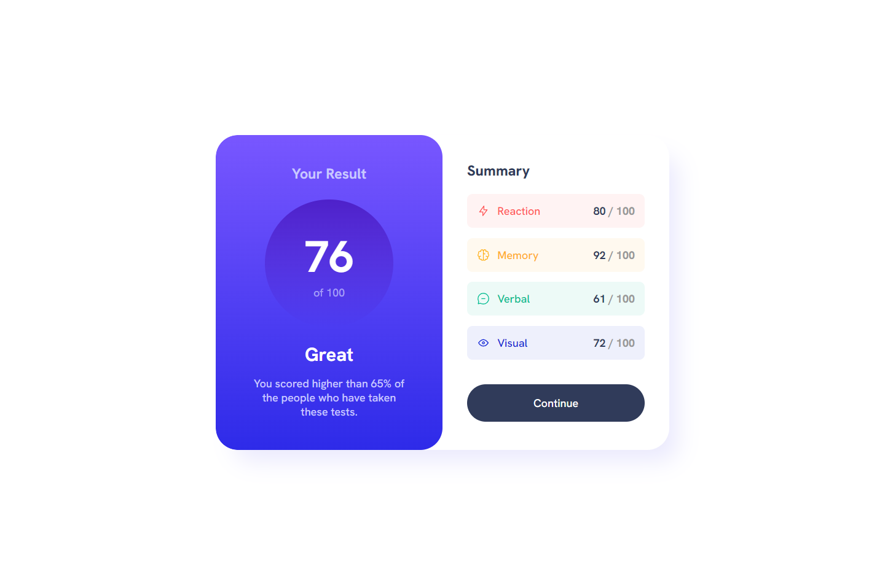

# Frontend Mentor - Results summary component solution

This is a solution to the [Results summary component challenge on Frontend Mentor](https://www.frontendmentor.io/challenges/results-summary-component-CE_K6s0maV). Frontend Mentor challenges help you improve your coding skills by building realistic projects. 

## Table of contents

- [Overview](#overview)
  - [The challenge](#the-challenge)
  - [Screenshot](#screenshot)
  - [Links](#links)
- [My process](#my-process)
  - [Built with](#built-with)
  - [Useful resources](#useful-resources)
- [Author](#author)

## Overview

### The challenge

Users should be able to:

- View the optimal layout for the interface depending on their device's screen size
- See hover and focus states for all interactive elements on the page
- **Bonus**: Use the local JSON data to dynamically populate the content

### Screenshot

### Links

- Solution URL: [https://github.com/Yejin-Han/JS-frameworks-libraries-practice/results-summary-component-main/build](https://github.com/Yejin-Han/JS-frameworks-libraries-practice/results-summary-component-main/build)
- Live Site URL: [https://yejin-han.github.io/JS-frameworks-libraries-practice/results-summary-component-main/build/](https://yejin-han.github.io/JS-frameworks-libraries-practice/results-summary-component-main/build/)

## My process

### Built with

- Flexbox
- Mobile-first workflow
- [Vue](https://vuejs.org/) - JS framework
- [BEM](https://getbem.com/) - Block Element Modifier
- [SCSS](https://styled-components.com/) - For styles

### Useful resources

- [Resource 1](https://gist.github.com/JeffreyWay/1b609e460a2fe7c26b50f50e9497801f) - Transition of gradient

## Author

- Github - [Yejin Han(한예진)](https://github.com/Yejin-Han)
- Frontend Mentor - [@Yejin-Han](https://www.frontendmentor.io/profile/Yejin-Han)